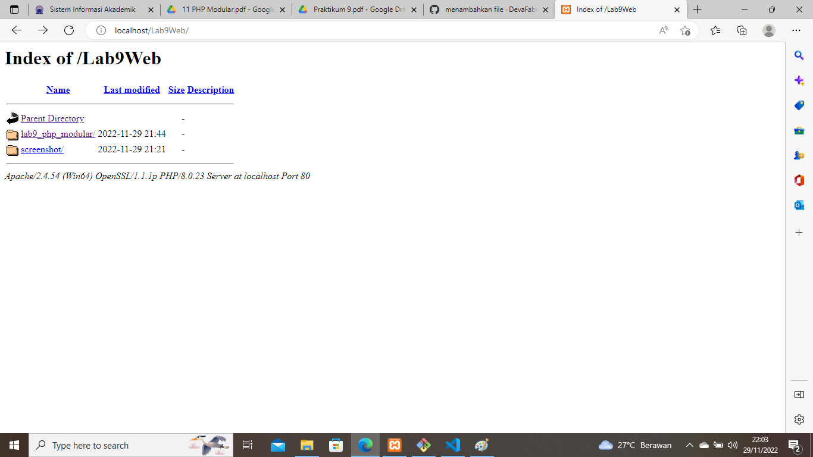
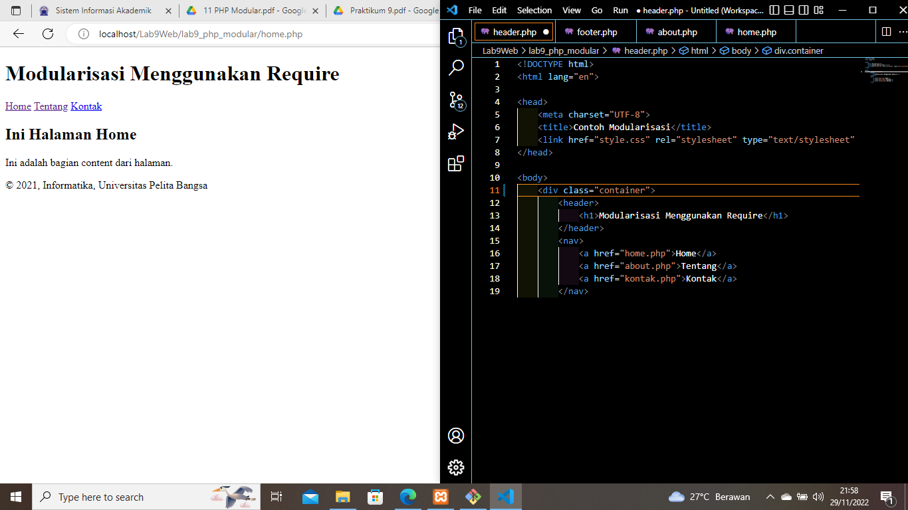
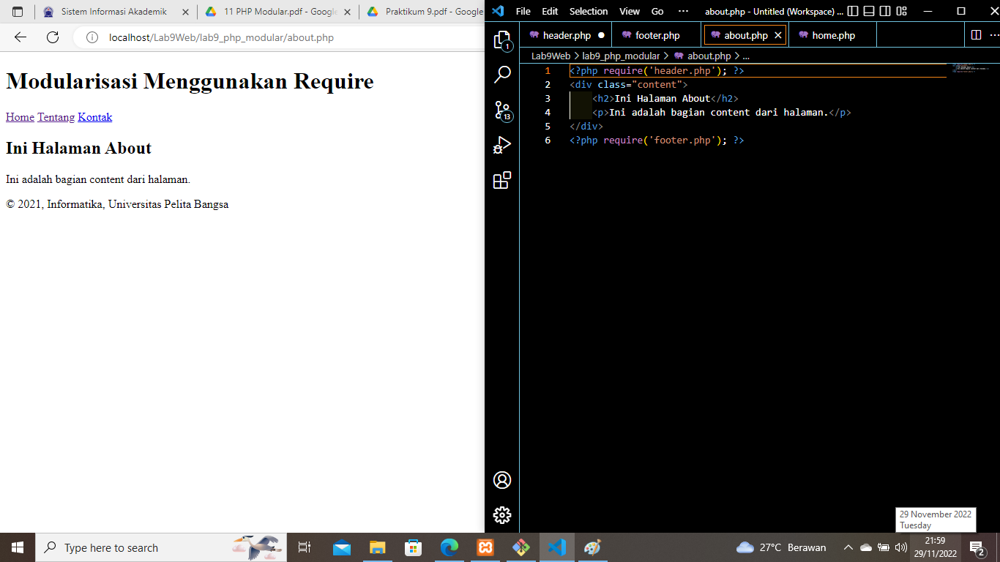
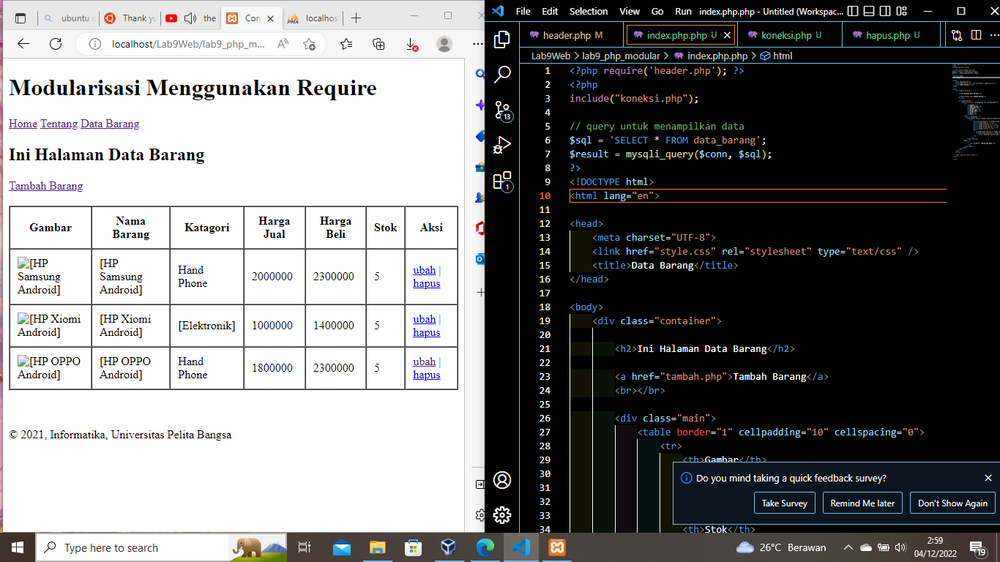

# Lab9Web

## PHP Modular

### Langkah - langkah Pratikum 9

#### membuat folder lab9_php_modular

Dengan mengaktifkan xampp terlebih dahulu untuk menyalakan aphace dan mysql, lalu kemudian membuat folder baru dengan nama lab9_php_modular pada root directory web server (c:\xampp\htdocs). dan bisa di cek melalui http://localhost/lab9_php_modular/ pada google chrome maupun mozila. Beginilah tampilannya:

#### Membuat Header, Footer dan Home

Dengan membuat halaman header dan footer terlebih dahulu. kemudian membuat file home untuk memanggilnya kita connectkan dengan file header dan footer yang sebelumnya dibuat. Inilah tampilannya:

#### Menambahkan File About

kemudian membuat file about untuk memanggilnya kita connectkan dengan file header dan footer yang sebelumnya dibuat. Inilah tampilannya:

#### Hasil Pratikum 9 yang diimplementasikan dengan pratikum 8

konsep modularisasi pada kode program praktikum 8 tentang
database, sehingga setiap halamannya memiliki template tampilan yang sama. Inilah tampilany:

